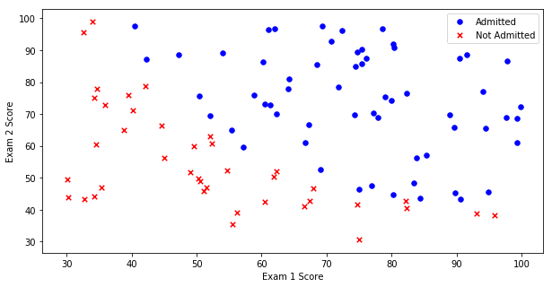
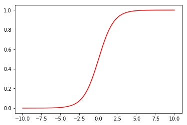
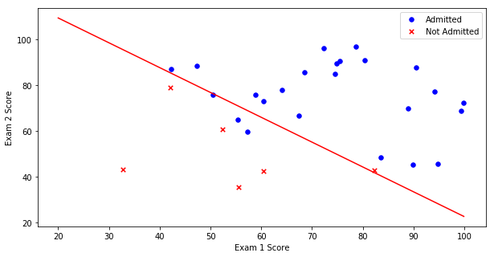

```python
import pandas as pd
import numpy as np
import matplotlib.pyplot as plt
```

# 1. 导入数据集

## 1.1 读取文件 txt2csv


```python
path = 'LogiReg_data.txt'
colnames = ['Exam 1', 'Exam 2', 'Admitted']
dataset = pd.read_csv(path, header=None, names=colnames)
```

## 1.2 查看（首尾）数据


```python
dataset.head()
```


<div>
<style scoped>
    .dataframe tbody tr th:only-of-type {
        vertical-align: middle;
    }

    .dataframe tbody tr th {
        vertical-align: top;
    }

    .dataframe thead th {
        text-align: right;
    }
</style>
<table border="1" class="dataframe">
  <thead>
    <tr style="text-align: right;">
      <th></th>
      <th>Exam 1</th>
      <th>Exam 2</th>
      <th>Admitted</th>
    </tr>
  </thead>
  <tbody>
    <tr>
      <th>0</th>
      <td>34.623660</td>
      <td>78.024693</td>
      <td>0</td>
    </tr>
    <tr>
      <th>1</th>
      <td>30.286711</td>
      <td>43.894998</td>
      <td>0</td>
    </tr>
    <tr>
      <th>2</th>
      <td>35.847409</td>
      <td>72.902198</td>
      <td>0</td>
    </tr>
    <tr>
      <th>3</th>
      <td>60.182599</td>
      <td>86.308552</td>
      <td>1</td>
    </tr>
    <tr>
      <th>4</th>
      <td>79.032736</td>
      <td>75.344376</td>
      <td>1</td>
    </tr>
  </tbody>
</table>
</div>


```python
dataset.tail()
```


<div>
<style scoped>
    .dataframe tbody tr th:only-of-type {
        vertical-align: middle;
    }

    .dataframe tbody tr th {
        vertical-align: top;
    }

    .dataframe thead th {
        text-align: right;
    }
</style>
<table border="1" class="dataframe">
  <thead>
    <tr style="text-align: right;">
      <th></th>
      <th>Exam 1</th>
      <th>Exam 2</th>
      <th>Admitted</th>
    </tr>
  </thead>
  <tbody>
    <tr>
      <th>95</th>
      <td>83.489163</td>
      <td>48.380286</td>
      <td>1</td>
    </tr>
    <tr>
      <th>96</th>
      <td>42.261701</td>
      <td>87.103851</td>
      <td>1</td>
    </tr>
    <tr>
      <th>97</th>
      <td>99.315009</td>
      <td>68.775409</td>
      <td>1</td>
    </tr>
    <tr>
      <th>98</th>
      <td>55.340018</td>
      <td>64.931938</td>
      <td>1</td>
    </tr>
    <tr>
      <th>99</th>
      <td>74.775893</td>
      <td>89.529813</td>
      <td>1</td>
    </tr>
  </tbody>
</table>
</div>


## 1.3 数据统计信息


```python
dataset.info()
```

    <class 'pandas.core.frame.DataFrame'>
    RangeIndex: 100 entries, 0 to 99
    Data columns (total 3 columns):
    Exam 1      100 non-null float64
    Exam 2      100 non-null float64
    Admitted    100 non-null int64
    dtypes: float64(2), int64(1)
    memory usage: 2.4 KB
    

**无空数据，不需要额外处理**


```python
dataset.describe()
```


<div>
<style scoped>
    .dataframe tbody tr th:only-of-type {
        vertical-align: middle;
    }

    .dataframe tbody tr th {
        vertical-align: top;
    }

    .dataframe thead th {
        text-align: right;
    }
</style>
<table border="1" class="dataframe">
  <thead>
    <tr style="text-align: right;">
      <th></th>
      <th>Exam 1</th>
      <th>Exam 2</th>
      <th>Admitted</th>
    </tr>
  </thead>
  <tbody>
    <tr>
      <th>count</th>
      <td>100.000000</td>
      <td>100.000000</td>
      <td>100.000000</td>
    </tr>
    <tr>
      <th>mean</th>
      <td>65.644274</td>
      <td>66.221998</td>
      <td>0.600000</td>
    </tr>
    <tr>
      <th>std</th>
      <td>19.458222</td>
      <td>18.582783</td>
      <td>0.492366</td>
    </tr>
    <tr>
      <th>min</th>
      <td>30.058822</td>
      <td>30.603263</td>
      <td>0.000000</td>
    </tr>
    <tr>
      <th>25%</th>
      <td>50.919511</td>
      <td>48.179205</td>
      <td>0.000000</td>
    </tr>
    <tr>
      <th>50%</th>
      <td>67.032988</td>
      <td>67.682381</td>
      <td>1.000000</td>
    </tr>
    <tr>
      <th>75%</th>
      <td>80.212529</td>
      <td>79.360605</td>
      <td>1.000000</td>
    </tr>
    <tr>
      <th>max</th>
      <td>99.827858</td>
      <td>98.869436</td>
      <td>1.000000</td>
    </tr>
  </tbody>
</table>
</div>


## 1.4 数据示图


```python
positive = dataset[dataset['Admitted'] == 1] 
negative = dataset[dataset['Admitted'] == 0]
fig, ax = plt.subplots(figsize=(10,5))
ax.scatter(positive['Exam 1'], positive['Exam 2'], s=30, color='b', marker='o', label='Admitted')
ax.scatter(negative['Exam 1'], negative['Exam 2'], s=30, color='r', marker='x', label='Not Admitted')
ax.legend(), ax.set_xlabel('Exam 1 Score'), ax.set_ylabel('Exam 2 Score')
plt.show()
```





## 1.5 划分训练集与测试集


```python
sampleNum = len(dataset)
k = int(sampleNum * 0.7)
traindata = dataset[:k]
testdata = dataset[k:]
print(f'traindata.shape={traindata.shape} \n testdata.shape={testdata.shape}')
```

    traindata.shape=(70, 3) 
     testdata.shape=(30, 3)
    

# 2. 分类器设计

## 2.1 sigmoid 函数


```python
def sigmoid(x):
    return 1 / (1 + np.exp(-x))
```

**计算时可能会发生溢出，但不用理会。比如：**


```python
np.exp(1000)
```

    d:\program files\python\lib\site-packages\ipykernel_launcher.py:1: RuntimeWarning: overflow encountered in exp
      """Entry point for launching an IPython kernel.
    


    inf


**绘制sigmoid图像**


```python
tmp_x = np.arange(-10.0, 10.0, 0.01)
plt.plot(tmp_x, sigmoid(tmp_x), 'r')
plt.show()
```





## 2.2 梯度下降法，求带正则项的代价函数的最小 θ


```python
x_train = traindata.values[:,:2]
y_train = traindata.values[:, 2:3]       # 取出单独一列，保证是列向量，不然容易出问题
print(x_train.shape, y_train.shape)
```

    (70, 2) (70, 1)
    


```python
def grad_descent(X, Y, λ=0, α=0.01, cycleNum=1000):
    """
    输入参数：
        X：mxn 矩阵，np.array类型，数据集里的特征数据
        Y：mx1 列向量
        α：学习率
        n：最大迭代次数
        λ：正则项系数
    """
    m, n = X.shape
    X = np.hstack([np.ones((m, 1)), X])      # 为X增加偏置列
    XT = X.T                                 # 转置X
    weights = np.ones((n+1, 1))              # 模型系数向量 weights，nx1

    for k in range(cycleNum):               # 不建议使用 np.matrix类
        h = sigmoid(np.matmul(X, weights))   # 矩阵乘法，建议使用 np.matmul：  m x 3 ，3 x 1
        weights = weights - α * (np.matmul(XT, h - Y) - λ*weights)
        
    return weights
```


```python
weights = grad_descent(x_train, y_train, λ=1)
print(weights)
```

    [[-94891.51521142]
     [   785.12565184]
     [   724.68297534]]
    

    d:\program files\python\lib\site-packages\ipykernel_launcher.py:2: RuntimeWarning: overflow encountered in exp
      
    

## 2.3 构建预测模型


```python
def classifier(X, weights):
    m, n = X.shape
    X = np.hstack([np.ones((m, 1)), X])      # 为X增加偏置列
    p = sigmoid(np.matmul(X, weights))
    predlabel = []
    for i in range(m):
        if p[i] > 0.5:
            predlabel.append(1)
        else:
            predlabel.append(0)
    return predlabel
```

## 2.4 预测正确率


```python
def evaluate(reallabel, predlabel):
    sum = 0
    for r, p in zip(reallabel, predlabel):
        if r == p:
            sum += 1
    wrongNum = len(reallabel) - sum
    return sum/len(reallabel), wrongNum
```


```python
x_test = testdata.values[:,:2]
y_test = testdata.values[:, 2:3]       # 取出单独一列，保证是列向量，不然容易出问题
y_pred = classifier(x_test, weights)
accuracy, wrongNum = evaluate(y_test, y_pred)
print (f'正确率是：{accuracy}\n识别错误个数：{wrongNum}')
```

    正确率是：0.8666666666666667
    识别错误个数：4
    

    d:\program files\python\lib\site-packages\ipykernel_launcher.py:2: RuntimeWarning: overflow encountered in exp
      
    

## 2.5 分类示图


```python
positive = testdata[testdata['Admitted'] == 1] 
negative = testdata[testdata['Admitted'] == 0]
x = np.arange(20.0, 100.0, 0.1)
y = (-weights[0] - weights[1] * x) / weights[2]
fig, ax = plt.subplots(figsize=(10,5))
ax.plot(x, y, 'r')
ax.scatter(positive['Exam 1'], positive['Exam 2'], s=30, color='b', marker='o', label='Admitted')
ax.scatter(negative['Exam 1'], negative['Exam 2'], s=30, color='r', marker='x', label='Not Admitted')
ax.legend(), ax.set_xlabel('Exam 1 Score'), ax.set_ylabel('Exam 2 Score')
plt.show()
```




